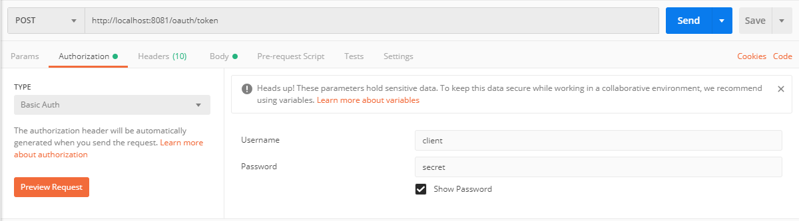
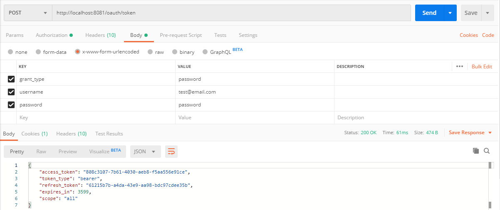
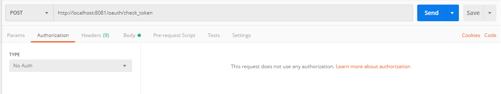
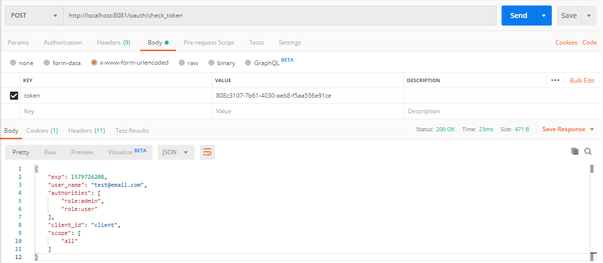

# In memory H2 database console
  
- http://localhost:8080/h2-console

# OAuth2 Authorization end point

## Obtain a token

  - POST http://localhost:8081/oauth/token
  
    
  
    
  
## Check a token

  - POST http://localhost:8081/oauth/check_token

    
  
    
  

### Database password BCrypt

- https://www.browserling.com/tools/bcrypt

https://shekhargulati.com/2018/02/15/single-sign-on-in-spring-boot-applications-with-spring-security-oauth/
https://spring.io/guides/tutorials/spring-boot-oauth2/
https://www.baeldung.com/spring-security-oauth2-enable-resource-server-vs-enable-oauth2-sso
https://www.baeldung.com/sso-spring-security-oauth2
https://dzone.com/articles/integrate-sso-with-spring-boot-and-oauth-20
https://dzone.com/articles/build-an-oauth-20-authorization-server-with-spring
